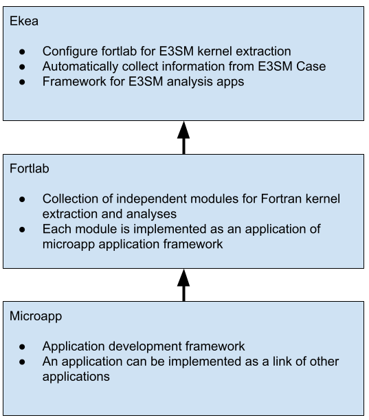

.. _developer-index:

*****************
Developer
*****************

ekea is built on top of Fortlab kernel extraction and analysis framework to make it easy to extract a kernel from E3SM as well as to build new tools for E3SM. Please see Fortral documentation for details.

In this article, we will explain how the source files of ekea are organized, how Fortlab functionalites are used, and what are the features unique to ekea.

Source files of ekea
========================

**main.py**: "E3SMKea" class is defined as an extension of "Fortlab" class. This class contains a list of application classes that uses Fortlab apps.

**e3smapp.py**: "E3SMKernel" class defined in this file drives overall process of kernel extraction using Fortlab applications.

**eam.py**: "EAMKernel" class in this file simply calls a function in "E3SMKernel" with an name exclusion list. 

**mpasocn.py**: "MPASOcnKernel" class in this file adjust the path to source files to support the MPAS ocean feature of dynamic source file generation and simply calls a function in "E3SMKernel" with an name exclusion list. 

**timing.py**: "KernelTimeViewer" class in this file generates kernel timing data and an interactive plot.

**varwhere.py**: "VariableList" class in this file generates name reference information in generated kernel source files.

Overall Structure
========================

ekea is implemented based on fortlab modules that implement core functions of Fortran kernel extraction and analysis.

Ekea Code Structure
========================

T.B.D.

.. toctree::
    :maxdepth: 2

