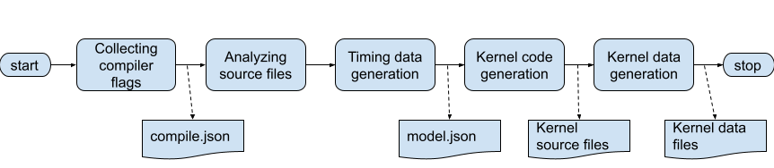

.. _commands-trouble:

=============================
Extraction Troubleshootings
=============================

The execution of ekea is consist of several consecutive steps.

After completion, some steps produce intermittent outputs as shown above.

The basic approach to resolve issue during kernel extraction is to identify which step went wrong by locating those intermittent outputs.

Ekea checks if those intermittent outputs exist. If so, Ekea skip the steps required to generate the outputs. For some reasion, if you do not want to skip those steps, just remove the output files.

.. toctree::
    :maxdepth: 2

    compile
    model
    kernel

